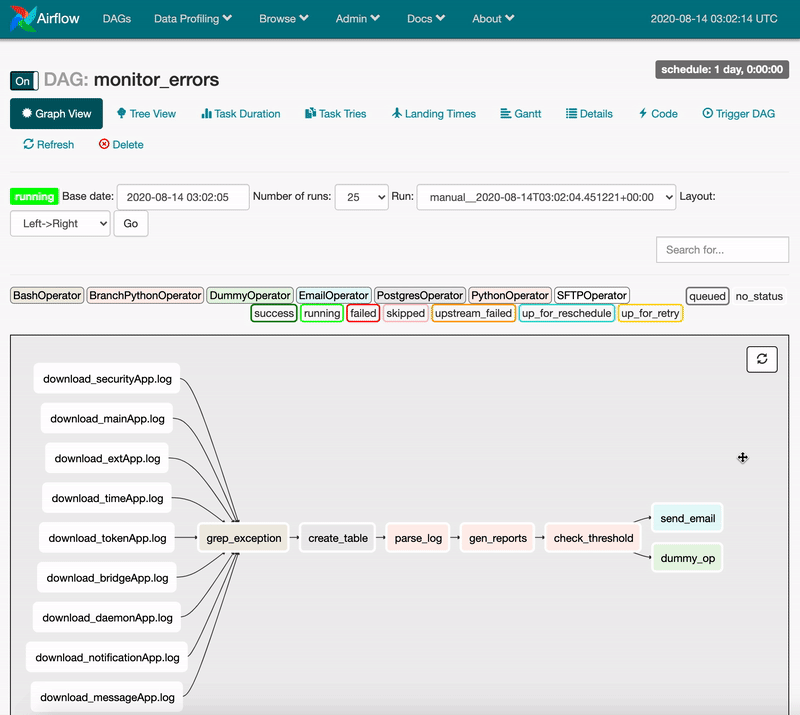

# Build An Airflow Data Pipeline to Monitor Errors

towards data science:  
[Step by step: build a data pipeline with Airflow](https://towardsdatascience.com/step-by-step-build-a-data-pipeline-with-airflow-4f96854f7466)

---

## References
https://github.com/puckel/docker-airflow
